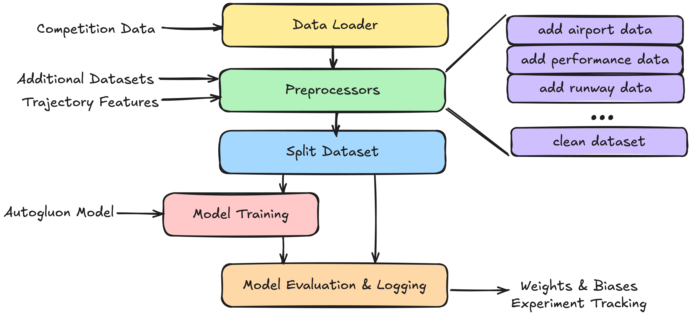

# Project Overview

## General Overview
Our goal with the challenge was to integrate as many data sources as possible into our dataset and use AutoML for the tedious taks like feature selection, hyperparameter tuning and ensembling. Therefore, the main focus is put on the input data, rather than the mode itself. To be able to effectively iterate on and leverage external datasets, we created a class for each preprocessor. A preprocessor class alters the dataset. Some preprocessors depend on previous preprocessor features, some add external data. For better performance, each preprocessor acts as a smart caching layer using [**joblib**](https://github.com/joblib/joblib). For an identical input, the output is retrieved from cache, once the input changes, the processing is being triggered. This saved us time and headaches during development. For additional performance, we used the functools caching decorator throughout our computations. As for model selection we took inspiration from Kaggle competitions and chose [**Autogluon**](https://github.com/autogluon/autogluon), which is the leading AutoML tool developed by Amazon. Autogluon will try all kinds of gradient boosted trees, sklearn classifiers and neural networks and finally builds a stacked ensemble automatically. Conveniently, we can specify a time limit for the training, the more time we spend, the better the model. Lastly, we wanted to keep track of different versions and store intermediate models, therefore we set up [**Weights & Biases**](https://github.com/wandb/wandb) as an experiment tracking tool. 

W&B allows us to monitor the training in the browser from anywhere, including plots, tables and logging output. For example, the feature importance of each feature is logged as a table after each training. The full feature importance table of one of the last models can be seen [here](feature_importance.csv). We also log validation set predictions and all metrics like RMSE, MAE etc. Weights & Biases also stores our models as artifacts in the cloud. Here it should be noted that online use of W&B is of course optional for our solution. We intended to write a decoupled logging class to make it modular but we were too limited in time.

## Preprocessor Overview
We now describe all used preprocessors and how the transform the dataset. Single feature columns are described [here](dataset_overview.md).
The preprocessors are described in the order they are used.

### AirportPreprocessor
### OpenAPAircraftPerformancePreprocessor
### AircraftPerformancePreprocessor
### FuelPricePreprocessor
### RunwayInfoPreprocessor
### PaxFlowPreprocessor
### WeatherDataPreprocessor
### WeatherSafetyFeatures
### DerivedFeaturePreprocessor
### TrajectoryPreprocessor
### OpenAPFuelFlowPreprocessor
### FeatureEngineeringPreprocessor
### CreativeWeightPreprocessor
### CleanDatasetPreprocessor

The final dataset has a number of features in addition to the features provided by the PRC Data Challenge training/challenge data. A comprehensive overview of these features is available [here](dataset_overview.md).

## Final Submission Dataset
The final submission dataset is once again cleaned, because we found a lot of less important features during our analysis. These feature columns are removed from the dataset with the `CleanDatasetPreprocessor.py`, before the model is trained.   

## Extensibility

We purposefully designed our project to be able to include various data sources and different machine learning models:

1. **New Data Sources**
   - Add new data to the project `additional_data` directory that might be useful for ATOW 
   - Create new preprocessor classes inheriting from `BasePreprocessor`
   - Implement the `process` method to transform raw data into useful features
   - Add the preprocessor to the pipeline configuration in the `run.py` or `run_wandb.py` script

2. **Alternative Models**
   - Implement new model classes inheriting from `BaseModel`
   - Customize training and prediction logic of new model
   - Add model-specific configurations and hyperparameters
  

